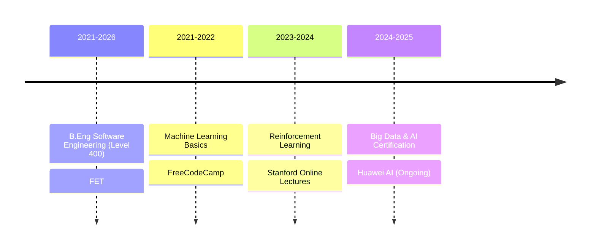

# ResumeSheet
<div align="center">
  
# 👨‍💻 Dyl Padaran Ambe Munjo
#### Data Scientist | Full-Stack Developer | Mobile Flutter Developer

[](https://github.com/Dy1777)
[](https://github.com/Dy1777)
[](https://github.com/Dy1777)

</div>

---

## 🎯 About Me 

```python
class DylPadaran:
    def __init__(self):
        self.role = "Data Scientist & Full-Stack Developer"
        self.location = "Limbe/Buea, Southwest, Cameroon"
        self.languages = ["Python", "Java", "C++", "Rust", "Dart", "Golang", "PHP"]
        self.challenge = "Building innovative solutions through code"
```

## 📱 Contact Information
[](mailto:dylpadaran77@gmail.com)
[](https://github.com/Dy1777)
[](#)
[](#)

## 💼 Work Experience

### 🌟 Current Roles
```yaml
Data Engineer:
  company: "School Mobile Fraud Transactions Datawarehouse"
  duration: "Nov 2024 - Present"
  tech_stack: ["AWS", "TiDBCloud", "PostgreSQL"]
  focus: "Fraud detection and anomaly detection systems"

IoT Intern:
  company: "Nervtek"
  duration: "June 2023 - "
  skills: ["Arduino Cloud", "ESP32", "C Programming"]
```

### 🚀 Previous Positions
```yaml
ReactJS Backend:
  company: "Unity Group"
  duration: "Jun 2024 - Sep 2024"
  focus: "MongoDB and non-SQL databases"

Java Backend:
  company: "School MediKare"
  duration: "Jan 2024 - Mar 2024"
  project: "Hospital booking system with Maven"

Flutter/Dart:
  company: "Disaster Management Application"
  duration: "Nov 2022 - Jan 2023"
  focus: "Firebase backend integration & BeautifulSoup+Puppeteer Scraping"
```

## 🎓 Education



## 💻 Technical Arsenal

```typescript
const technicalSkills = {
    programming: {
        languages: ['Python', 'Java', 'JavaScript', 'C/C++', 'Rust', 'Dart/Flutter', 'Golang', 'PHP'],
        proficiency: 'Advanced'
    },
    webDevelopment: {
        frontend: ['ReactJS', 'HTML', 'CSS', 'JavaScript'],
        backend: ['Laravel', 'SQL', 'WordPress'],
        databases: ['MongoDB', 'PostgreSQL']
    },
    specializedTools: ['LaTeX', 'KaTeX', 'Bash', 'VBA'],
    cloudAndIoT: ['AWS', 'Arduino', 'TiDBCloud', 'ESP32'],
    softSkills: ['Technical Writing', 'Documentation', 'Problem Solving']
};
```

## 📊 GitHub Activity

<div align="center">
  
[](https://github.com/Dyl777)

[](https://github.com/Dyl777)

</div>

## 🏆 Notable Projects

### 🌟 Disaster Management Application
```javascript
{
    "type": "Community Safety Project",
    "implementation": "Flutter & Firebase + python scraper backend",
    "region": "Southwest Region",
    "features": [
        "Real-time disaster alerts",
        "Community notifications",
        "Emergency response coordination"
    ]
}
```

### 📊 Mobile Fraud Detection System
```python
project_specs = {
    "category": "Data Engineering",
    "architecture": ["AWS", "TiDB", "PostgreSQL"],
    "status": "In Production",
    "features": [
        "Real-time fraud detection",
        "Anomaly detection",
        "Transaction monitoring",
        "Alert system"
    ]
}
```

## 📈 Skill Proficiency

---

<div align="center">
  
### 🤝 Open to Collaboration and Innovation

[](mailto:dylpadaran77@gmail.com)

*Last Updated: 2025-01-15 22:16:48 UTC*

</div>
```
